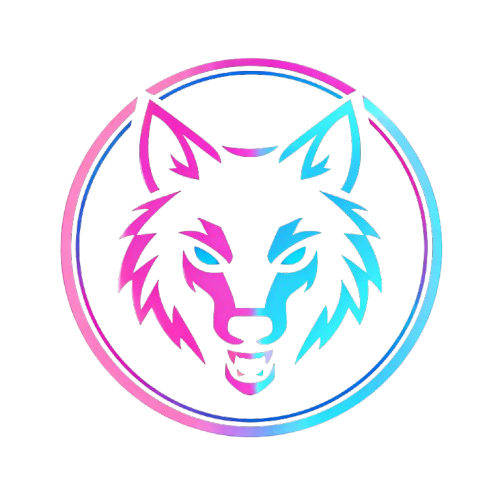

<!-- Logo -->

# 🚀 J33wakaDev Portfolio

### _Crafting Digital Experiences at the Speed of Light_

 

<!-- Add your portfolio screenshot here -->

 

**A futuristic, space-themed personal portfolio showcasing my journey as a Full-Stack Developer.**

Built with cutting-edge technologies and featuring stunning animations, CRT monitor aesthetics, and a cosmic user experience.

[View Demo](https://jeewakasupun.dev) · [Report Bug](https://github.com/J33WAKASUPUN/Personal-Portfolio/issues) · [Request Feature](https://github.com/J33WAKASUPUN/Personal-Portfolio/issues)

---

## 📸 Screenshots

### 🏠 Hero Section
<!-- Add hero section screenshot -->

### 💼 Projects Showcase
<!-- Add projects section screenshot -->

### 🛠️ Tech Stack
<!-- Add tech stack section screenshot -->

### 📱 Mobile Responsive
<!-- Add mobile screenshot -->

---

## ✨ Features

<table>
<tr>
<td width="50%">

### 🎨 **Design & UX**
- 🌌 Space-themed futuristic aesthetic
- 🖥️ CRT monitor-styled cards
- ✨ Neon glow effects (Cyan & Magenta)
- 🌟 Animated starfield background
- 🎯 Custom cursor with trailing effect
- 📱 Fully responsive (Mobile-first)
- 🌙 Dark mode optimized

</td>
<td width="50%">

### ⚡ **Performance**
- 🚀 Pre-loader with data prefetching
- 💾 In-memory API caching (10 min)
- 📦 Code splitting & lazy loading
- 🔄 Service Worker for offline support
- 🗜️ Optimized build with Terser
- 🎬 60fps smooth animations
- 📊 Lighthouse score 90+

</td>
</tr>
</table>

### 🔧 **Technical Features**

| Feature | Description |
|---------|-------------|
| 🏠 **Dynamic Hero** | Typewriter animation, profile image, social links |
| 📊 **About Stats** | Auto-calculated experience, projects count, tech stack |
| 🎓 **Education** | Academic timeline with certifications marquee |
| 💼 **Experience** | Multi-role support per company, achievements |
| 🛠️ **Tech Stack** | Grouped by category, brand colors, official logos |
| 🚀 **Projects** | Featured carousel, filtering, detailed modals |
| 📝 **Blog** | Medium RSS integration, auto-sync |
| 📧 **Contact** | EmailJS integration, social links from API |
| 📈 **Analytics** | Page views, project views, visitor tracking |

---

## 🛠️ Tech Stack

### Frontend

### Backend

### DevOps & Hosting

---

